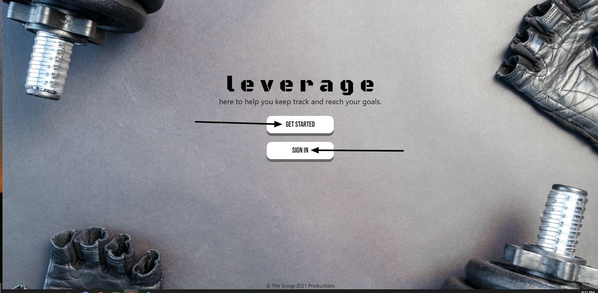
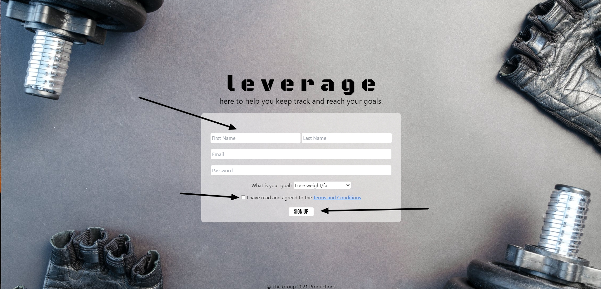
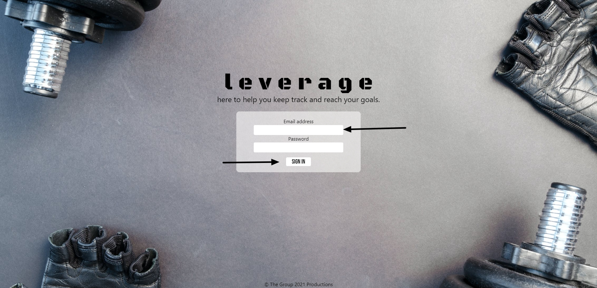
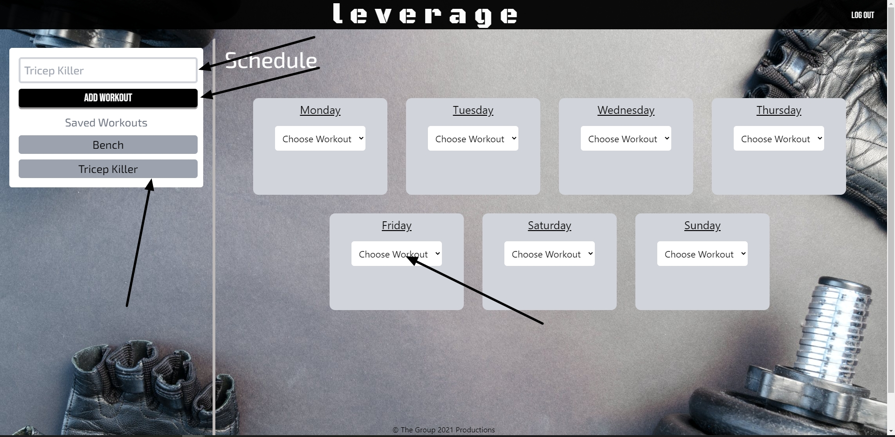
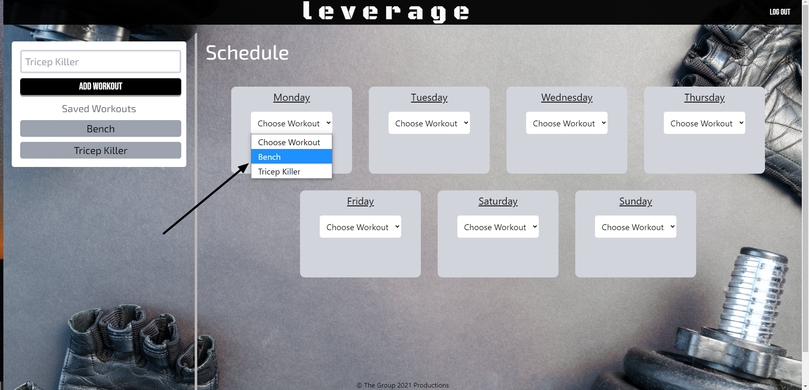
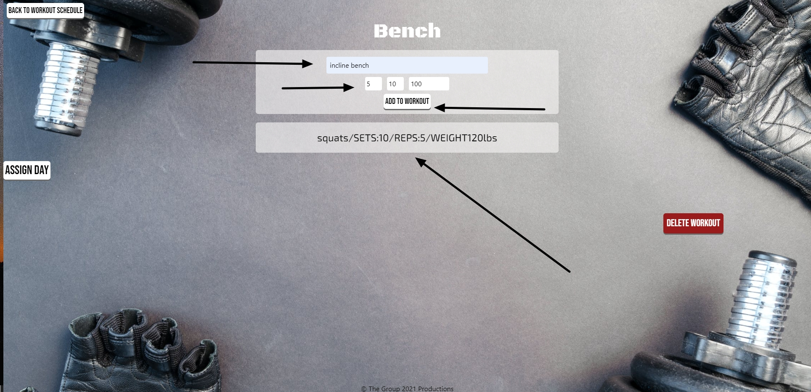
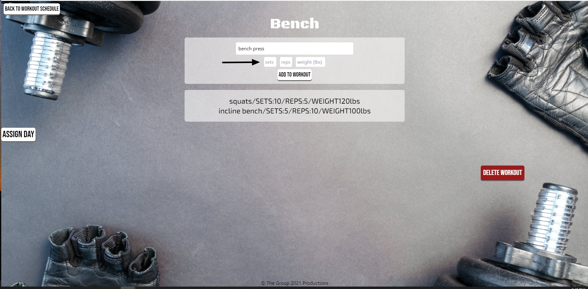

# Leverage
  
<a href="https://github.com/jackmanzer/t8100x" target="_blank">Leverage on Github</a>

Version 1.0 \
Deployment: Nov 4, 2021 \
Contributors: 
- [Brian Albright](https://github.com/bmalbright)
- [Bradley O'Dell](https://github.com/BradMW)
- [Jack Manzer](https://github.com/jackmanzer)
- [James Garinger](https://github.com/originator1)
- [Jayla Newton](https://github.com/jayladenae) 

## Description
  Our application allows anyone to organize, build, and customize their own personal workout plan! You can add each unique workout to any specific day of the week and plan your workout schedule as you would like to!
## User Guide 
<!-- Deployed Link -->
Here you will find a step by step guide on how to navigate through the Leverage Workout Application. Below are images of each browser page and a description of the functionality of each page you can navigate to. 

---
1. __Home Page__

This is our homepage, where you are initally directed to upon accessing our application where you would first create an account to access all functionality of the app. 

- Get Started button to create a account if you do not have an account already saved. \
- Sign In button to sign in if you have already created an account. 

2. __Get Started__

If you do not have an account already, and have clicked the get started button from the main home page, you will automatically be prompted with the form in the image below.

- Input information into form fields to save to created account profile.
- Then click arrow dropdown to populate a options list of your desired goal from your workouts.
- Read terms and condions of signing up to our application and check box to confirm.
- Then click Sign Up button to create your brand new account!

3. __Sign In__

If you have already created a account from previously visiting our application, simply click the Sign In button from the Home Page! A simple login form shown in below image will be displayed for login credentials. 

- Fill in email address and password fields with already created account credentials.
- Click Sign In button and you will be logged into your account and have access to the full functionality of the application.

4. __Create Workout__

Once you have clicked your workouts name you will then be redirected to your new workouts page, where you can add exercises! To add an exercise you just have to enter the new exercise's name in the given input field next to the 'Add Exercise' button. You may then click that button to populate the rest of the form so you can add the set, reps, and weight. Once you're finished you may click the 'Add to workout' button and your new exercise will populate below! You can add as many exercises as you want!

- Enter a name of workout you want to create in form on left hand side of the page.
- Click the ADD WORKOUT button to create a button and add it to the list of workout buttons located underneath.
- Once you have added workouts and buttons have been created for each workout, you can then click the generated button to be directed to a exercise page to modify and add exercises to that workout.

5. __Add workout to day of week__

You can also add a created workout to the specified day of the week you would like to actually do that exercise.

- If you would like, you can then select the day of the week to save that workout by finding the day and using the dropdown box to select the prefered workout for that day.

6. __Linking a exercise to a workout__ 

After clicking on one of your created workout buttons, you will be directed to the exercise creation page. This page allows you to add a exercise to the workout selected and specify amount of sets, reps, and weight desired.

- Enter name of exercise you are wanting to create
- Specify amount of sets, reps, and weight for this exercise
- After filling out exercise information fields, click ADD TO WORKOUT button. This will create a list directly below where you can see all the created exercises for that workout 

7. __You have now created your workout with a list of exercises you would like to perform and save to any day of the week you plan to do them!__

---

### Built Utilizing
- Javascript
- Node JS
- Express
- Handlebars
- MySQL
- Sequelize
- Tailwind CSS
- Bcrypt

### Future Developments:
- Adding click functionality to workouts saved to each day of the week. When clicked taking user to exercise page, and displaying each exercise in a user friendly view.
- Have a checkbox form to select day of week you would like to add the exercise you are creating on the actual create exercise page and adding it to the day of week schedule dynamically.
- Adding moment time display to navigation bar
- Showing different color selection to day of week schedule for previous days, current day, and future days of that current week based of moment time display for better UI
- Timer and ability to check off exercises as you do them
- Cardio options with more detailed forms
### Contribute!
If you would like to make a contribution to this application or have any suggestions, feel free to
<a href="mailto:jacklovestombrady@gmail.com" target="_blank">Contact Us!</a>
 

